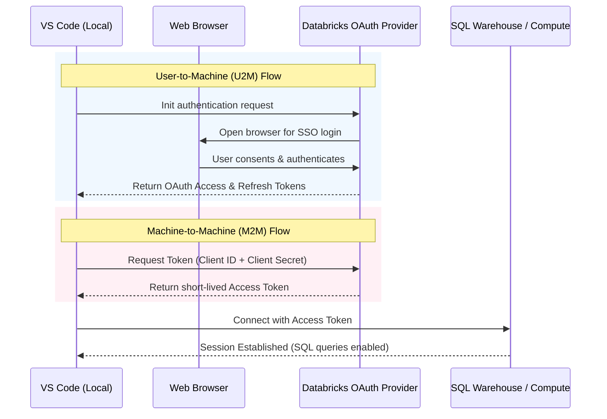

# External Databricks Connection Guide: VS Code to Databricks (OAuth)

This guide details how to establish an external connection from a local **VS Code** development environment to a **Databricks** workspace to read and store data inside Databricks tables using **OAuth** authentication.

---

## 1. Authentication Methods

Databricks supports two OAuth patterns for external client connections:
1. **User-to-Machine (U2M) OAuth:** Best for local, interactive development. It triggers a browser login popup to authenticate using your standard Databricks user credentials.
2. **Machine-to-Machine (M2M) OAuth:** Best for unattended scripts, CI/CD, and production backend code. It uses a **Service Principal** client ID and client secret.



---

## 2. Setting Up VS Code Databricks Extension (U2M OAuth)

Installing the official extension allows VS Code to natively sync code to Databricks, run notebooks on remote clusters, and handle OAuth tokens.

1. In VS Code, open the Extensions marketplace (`Ctrl+Shift+X` or `Cmd+Shift+X`).
2. Search for **Databricks** and click **Install**.
3. Click the **Databricks** icon on the VS Code Activity Bar (Sidebar).
4. Click **Configure** or **Add Profile**.
5. Set the profile parameters:
   - **Workspace URL:** `https://<workspace-id>.cloud.databricks.com`
   - **Authentication Type:** Select **OAuth (user-to-machine)**.
6. Click **Login**. VS Code will open your web browser.
7. Sign in using your corporate credentials/SSO. Once authenticated, return to VS Code.

---

## 3. Configuring the Databricks Config File (`.databrickscfg`)

The Databricks SDK and connector libraries read configuration profiles stored on your machine. Create or edit this file to persist your connection.

* File Location: 
  * Windows: `C:\Users\<username>\.databrickscfg`
  * macOS/Linux: `~/.databrickscfg`

Add the following profiles:

```ini
# ~/.databrickscfg

# 1. Interactive Developer Profile (U2M OAuth)
[DEVELOPER_PROFILE]
host = https://adb-1234567890123456.7.azuredatabricks.net/  ; Replace with your actual workspace URL
auth_type = databricks-oauth

# 2. Service Principal Profile (M2M OAuth)
[SERVICE_PRINCIPAL_PROFILE]
host = https://adb-1234567890123456.7.azuredatabricks.net/
client_id = 11111111-2222-3333-4444-555555555555            ; Service Principal Application ID
client_secret = dapi_your_client_secret_here                ; Service Principal Secret Value
```

---

## 4. Python Implementation: Connecting and Storing Data

Install the required Python packages in your local environment:
```bash
pip install databricks-sql-connector pandas
```

### A. Code for Local Developer Connection (U2M OAuth)
When executing this script locally, the connector will check your `.databrickscfg` or automatically launch a browser to log you in if the token has expired.

```python
import os
from databricks import sql
import pandas as pd

# Connection details (Gather these from your Databricks SQL Warehouse Connection Details)
SERVER_HOSTNAME = "adb-1234567890123456.7.azuredatabricks.net"
HTTP_PATH = "/sql/1.0/warehouses/abcdef1234567890"
CATALOG = "main"
SCHEMA = "default"

# Establish connection using the 'databricks-oauth' authentication type
connection = sql.connect(
    server_hostname=SERVER_HOSTNAME,
    http_path=HTTP_PATH,
    auth_type="databricks-oauth",
    catalog=CATALOG,
    schema=SCHEMA
)

try:
    with connection.cursor() as cursor:
        # Create Table (using Delta Lake format)
        cursor.execute("""
            CREATE TABLE IF NOT EXISTS tryon_history (
                user_id STRING,
                timestamp TIMESTAMP,
                original_image_url STRING,
                outfit_image_url STRING,
                result_image_url STRING
            ) USING DELTA;
        """)
        print("Table verified/created successfully.")

        # Insert a record
        cursor.execute("""
            INSERT INTO tryon_history 
            VALUES ('usr_1001', CURRENT_TIMESTAMP(), 'http://s3/orig.jpg', 'http://s3/outfit.jpg', 'http://s3/res.jpg');
        """)
        print("Record inserted successfully.")
        
        # Read records
        cursor.execute("SELECT * FROM tryon_history LIMIT 5")
        result = cursor.fetchall()
        for row in result:
            print(row)

finally:
    connection.close()
```

---

### B. Code for Automated Script Connection (M2M OAuth)
In a production web application (such as the FastAPI backend) or CI/CD environment, you use a Service Principal to query/store data without interactive popups.

Create a `.env` file in your workspace:
```env
# backend/.env
DATABRICKS_SERVER_HOSTNAME=adb-1234567890123456.7.azuredatabricks.net
DATABRICKS_HTTP_PATH=/sql/1.0/warehouses/abcdef1234567890
DATABRICKS_CLIENT_ID=11111111-2222-3333-4444-555555555555
DATABRICKS_CLIENT_SECRET=sc_your_client_secret_here
DATABRICKS_CATALOG=main
DATABRICKS_SCHEMA=default
```

Run the following Python script:

```python
import os
from dotenv import load_dotenv
from databricks.sdk.core import Config, oauth_service_principal
from databricks import sql

load_dotenv()

server_hostname = os.getenv("DATABRICKS_SERVER_HOSTNAME")

# Create credentials provider using service principal config
def credential_provider():
    config = Config(
        host=f"https://{server_hostname}",
        client_id=os.getenv("DATABRICKS_CLIENT_ID"),
        client_secret=os.getenv("DATABRICKS_CLIENT_SECRET")
    )
    return oauth_service_principal(config)

# Establish connection
connection = sql.connect(
    server_hostname=server_hostname,
    http_path=os.getenv("DATABRICKS_HTTP_PATH"),
    credentials_provider=credential_provider,
    catalog=os.getenv("DATABRICKS_CATALOG"),
    schema=os.getenv("DATABRICKS_SCHEMA")
)

try:
    with connection.cursor() as cursor:
        cursor.execute("SELECT CURRENT_USER();")
        print("Connected as Service Principal:", cursor.fetchone()[0])
        
        # Storing data via batch insert
        data_to_store = [
            ("usr_1002", "http://s3/orig2.jpg", "http://s3/out2.jpg"),
            ("usr_1003", "http://s3/orig3.jpg", "http://s3/out3.jpg")
        ]
        
        for user_id, orig, outfit in data_to_store:
            cursor.execute(
                "INSERT INTO tryon_history (user_id, timestamp, original_image_url, outfit_image_url) "
                "VALUES (%s, CURRENT_TIMESTAMP(), %s, %s);",
                (user_id, orig, outfit)
            )
        print("Stored batch records.")

finally:
    connection.close()
```

---

### C. Storing Pandas DataFrames directly in Databricks Tables
For data science workloads, you can write whole Pandas DataFrames using `databricks-connect` (Databricks native Spark connection) or using SQL cursor bulk inserts:

```python
import pandas as pd
from databricks import sql

# Sample DataFrame representing Try-On log activity
df = pd.DataFrame({
    'user_id': ['usr_99', 'usr_98'],
    'original_image_url': ['http://img1.jpg', 'http://img2.jpg'],
    'outfit_image_url': ['http://fit1.jpg', 'http://fit2.jpg'],
    'result_image_url': ['http://res1.jpg', 'http://res2.jpg']
})

connection = sql.connect(
    server_hostname=SERVER_HOSTNAME,
    http_path=HTTP_PATH,
    auth_type="databricks-oauth"
)

try:
    with connection.cursor() as cursor:
        # Convert DataFrame to SQL value tuples
        values_str = ", ".join(
            f"('{row.user_id}', CURRENT_TIMESTAMP(), '{row.original_image_url}', '{row.outfit_image_url}', '{row.result_image_url}')"
            for _, row in df.iterrows()
        )
        
        # Execute query
        cursor.execute(f"INSERT INTO tryon_history VALUES {values_str};")
        print(f"Uploaded {len(df)} rows to Databricks.")
finally:
    connection.close()
```
