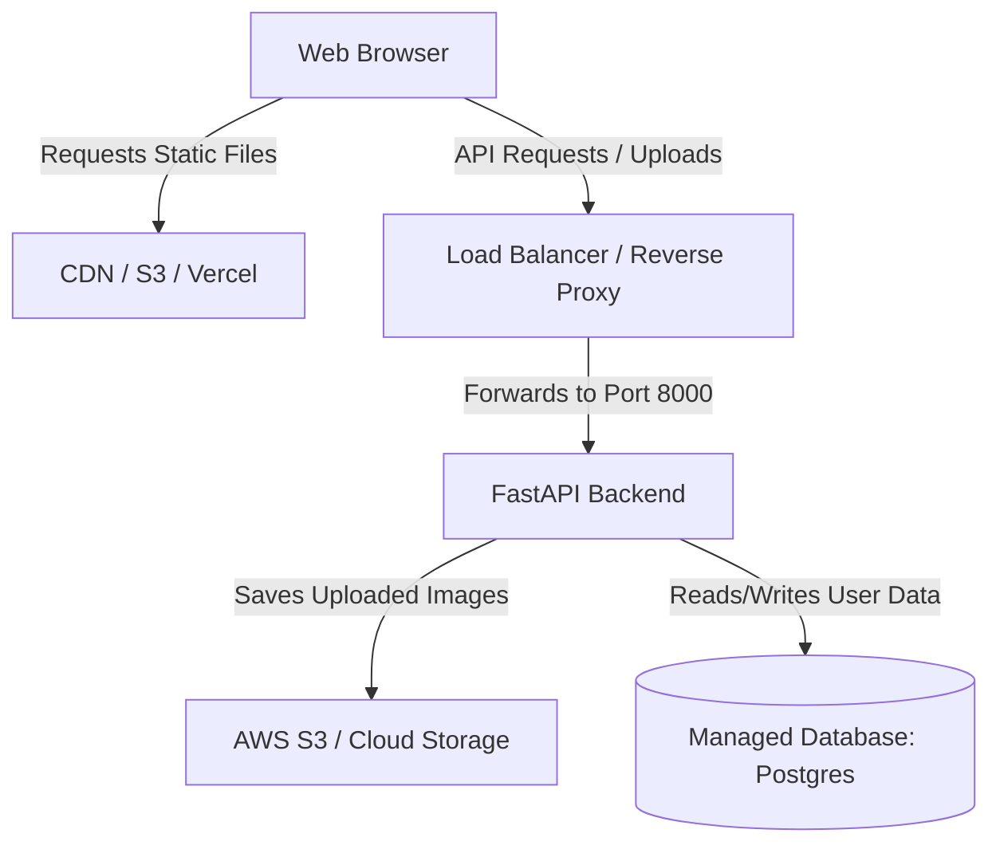

# Production Hosting Guide: Virtual Try-On Application

This guide describes how to deploy the React frontend and FastAPI backend of the Virtual Try-On application to production environments. It addresses production concerns such as database persistence, secure storage for image uploads, and containerization.

---

## 1. Architecture Overview

In a typical production setup, the React application is built as a static bundle and served either directly by an Object Storage Service/CDN (like AWS S3 + CloudFront) or bundled and served by the FastAPI application itself. 



### Production Constraints (SQLite vs. Managed DB)
> [!WARNING]
> The local development environment uses SQLite (`users.db`) and local disk storage. 
> Containerized deployments (like Docker, AWS ECS, GCP Cloud Run, or Render) have **ephemeral filesystems**. Any images uploaded or SQLite data stored locally will be **wiped** when the container restarts. 
> You **must** transition to a managed database (e.g., PostgreSQL) and cloud object storage (e.g., AWS S3) for production.

---

## 2. Preparing the Backend for Production

### A. Database Transition (SQLite to PostgreSQL)
To transition from SQLite to PostgreSQL, update your database connection pooling. In Python, this is typically done via `SQLAlchemy` or standard database drivers:

```python
# backend/utils/db_prod.py
import os
from sqlalchemy import create_engine
from sqlalchemy.orm import sessionmaker

# Use database URL from environment variables, fallback to SQLite for local development
DATABASE_URL = os.getenv("DATABASE_URL", "sqlite:///./users.db")

if DATABASE_URL.startswith("postgres://"):
    # Fix for Heroku/Render PostgreSQL URLs
    DATABASE_URL = DATABASE_URL.replace("postgres://", "postgresql://", 1)

engine = create_engine(DATABASE_URL, pool_pre_ping=True)
SessionLocal = sessionmaker(autocommit=False, autoflush=False, bind=engine)
```

### B. Moving to AWS S3 / Cloud Storage for Uploads
Modify your file-saving logic in `backend/routes/` or image utilities to upload to S3 instead of writing locally.

```python
# backend/utils/storage.py
import boto3
import os

s3_client = boto3.client(
    's3',
    aws_access_key_id=os.getenv('AWS_ACCESS_KEY_ID'),
    aws_secret_access_key=os.getenv('AWS_SECRET_ACCESS_KEY'),
    region_name=os.getenv('AWS_REGION')
)

BUCKET_NAME = os.getenv('S3_BUCKET_NAME')

def upload_image_to_s3(file_data, filename: str) -> str:
    s3_client.upload_fileobj(
        file_data,
        BUCKET_NAME,
        filename,
        ExtraArgs={"ContentType": "image/jpeg"}
    )
    return f"https://{BUCKET_NAME}.s3.amazonaws.com/{filename}"
```

---

## 3. Containerization with Docker

To make deployment seamless across cloud providers, dockerize the application.

### A. Dockerfile for FastAPI Backend
Create `backend/Dockerfile`:

```dockerfile
# backend/Dockerfile
FROM python:3.11-slim

WORKDIR /app

# Install system dependencies
RUN apt-get update && apt-get install -y --no-install-recommends \
    build-essential \
    && rm -rf /var/lib/apt/lists/*

# Install python packages
COPY requirements.txt .
RUN pip install --no-cache-dir -r requirements.txt

# Copy source code
COPY . .

# Expose port and run Gunicorn/Uvicorn
EXPOSE 8000
CMD ["uvicorn", "main:app", "--host", "0.0.0.0", "--port", "8000"]
```

### B. Multi-Stage Dockerfile (React Frontend)
Create `frontend_part/Dockerfile`:

```dockerfile
# frontend_part/Dockerfile
# Step 1: Build the React Application
FROM node:18-alpine AS builder
WORKDIR /app
COPY package*.json ./
RUN npm install
COPY . .
RUN npm run build

# Step 2: Serve the build directory using Nginx
FROM nginx:alpine
COPY --from=builder /app/dist /usr/share/nginx/html
# Copy custom Nginx configuration to handle SPA routing
COPY nginx.conf /etc/nginx/conf.d/default.conf
EXPOSE 80
CMD ["nginx", "-g", "daemon off;"]
```

*Create the matching Nginx configuration `frontend_part/nginx.conf`:*
```nginx
server {
    listen 80;
    server_name localhost;

    location / {
        root /usr/share/nginx/html;
        index index.html index.htm;
        try_files $uri $uri/ /index.html;
    }

    # Proxy API requests to the backend service
    location /api {
        proxy_pass http://backend-service:8000;
        proxy_set_header Host $host;
        proxy_set_header X-Real-IP $remote_addr;
    }
}
```

---

## 4. Deployment Guides

### Option A: Hosting on Render (Simple & Fast)
Render is a cloud platform that supports web service hosting, PostgreSQL databases, and static sites.

| Service Type | Repository Sub-path | Build Command | Start Command |
| :--- | :--- | :--- | :--- |
| **PostgreSQL** | N/A (Provision DB Service) | N/A | N/A |
| **Web Service (Backend)** | `backend/` | `pip install -r requirements.txt` | `uvicorn main:app --host 0.0.0.0 --port $PORT` |
| **Static Site (Frontend)** | `frontend_part/` | `npm install && npm run build` | N/A (Serve static directory `dist/` or `build/`) |

> [!IMPORTANT]
> When configuring the frontend on Render, set a Rewrite rule in the settings:
> - **Source:** `/*`
> - **Destination:** `/index.html` (Status: 200)
> Set the Environment Variable `VITE_API_URL` (or `REACT_APP_API_URL`) on the frontend to point to the Render backend service URL.

---

### Option B: Hosting on AWS (Production Grade)
AWS provides robust scaling and security configurations.

1. **Database:** Create an **Amazon RDS for PostgreSQL** database instance. Include the DB credentials in the FastAPI backend's environment configuration.
2. **Backend:** Deploy the Backend Docker image to **AWS App Runner** or **AWS ECS (Fargate)**.
   - Configure the environment variables: `DATABASE_URL`, `GEMINI_API_KEY`, `S3_BUCKET_NAME`, etc.
   - Keep the service running under a public Application Load Balancer (ALB).
3. **Frontend:** Build the frontend static assets locally or in a CI/CD pipeline and upload them to an **Amazon S3 Bucket**.
   - Configure the S3 Bucket for static website hosting.
   - Front the S3 Bucket with **Amazon CloudFront** (CDN) to ensure fast load times and HTTPS support.
   - Direct requests to `/api/*` to the AWS ECS ALB by configuring a CloudFront Origin Behavior.
